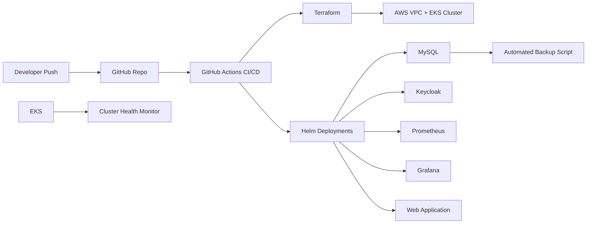

# 🚀 Enterprise DevOps Platform on AWS EKS


---

## 📌 Overview

This repository demonstrates a **production-style enterprise DevOps platform architecture** built on **AWS EKS** using Infrastructure-as-Code, CI/CD automation, observability tooling, and disaster-recovery backup workflows.

The platform provisions Kubernetes infrastructure and deploys:

* MySQL (stateful backend)
* Keycloak (identity provider)
* Prometheus + Grafana (observability stack)
* Custom web application (Helm-based deployment)
* Automated DB backup workflows
* Cluster health monitoring utilities

Designed to reflect **real-world Platform Engineering / SRE practices**.

---

## 🏗 Architecture Diagram



---

## ⚙️ Tech Stack

| Layer                   | Tools                |
| ----------------------- | -------------------- |
| Cloud                   | AWS                  |
| IaC                     | Terraform            |
| Container Orchestration | Kubernetes (EKS)     |
| Package Manager         | Helm                 |
| CI/CD                   | GitHub Actions       |
| Monitoring              | Prometheus + Grafana |
| Identity                | Keycloak             |
| Backup Automation       | Python               |
| Observability Scripts   | Python               |

---

## 📁 Repository Structure

```
enterprise-devops-platform/
│
├── terraform/              # VPC + EKS infrastructure provisioning
├── helm/                   # Platform service deployment scripts
├── .github/workflows/      # CI/CD automation pipelines
├── backup/                 # MySQL backup automation
├── monitoring/             # Kubernetes health monitoring toolkit
└── README.md
```

---

## 🚀 Deployment Workflow

### Step 1 — Provision Infrastructure

```
cd terraform
terraform init
terraform apply
```

Creates:

* Multi-AZ VPC
* Private/Public subnets
* Managed EKS cluster
* IRSA-enabled node groups

---

### Step 2 — Configure Cluster Access

```
aws eks update-kubeconfig \
  --region ap-south-1 \
  --name enterprise-platform-cluster
```

Verify:

```
kubectl get nodes
```

---

### Step 3 — Deploy Platform Stack

```
bash helm/deploy.sh
```

Deploys:

* MySQL
* Keycloak
* Prometheus
* Grafana
* Web application

---

### Step 4 — Enable Monitoring Automation

```
python monitoring/cluster_monitor.py
```

Detects:

* unhealthy pods
* node readiness issues
* restart loops
* PVC visibility

---

### Step 5 — Execute Backup Workflow

```
python backup/backup.py
```

Performs:

* MySQL logical dumps
* Cassandra snapshot support (extendable)
* checksum validation
* S3 archival (optional extension)

---

## 🔐 Terraform Remote State

Supports:

* S3 backend storage
* DynamoDB locking
* encrypted state management
* multi-environment structure

Example:

```
terraform {
  backend "s3" {
    bucket         = "enterprise-devops-tf-state"
    key            = "platform/eks/terraform.tfstate"
    region         = "ap-south-1"
    encrypt        = true
  }
}
```

---

## 📊 Observability Stack

Prometheus collects:

* node metrics
* pod metrics
* container metrics
* API server metrics

Grafana dashboards visualize:

* cluster health
* resource usage
* workload trends

---

## 🛡 Reliability Engineering Features

This platform demonstrates:

* Infrastructure as Code provisioning
* Helm-based service lifecycle management
* automated rollback support
* backup checksum validation
* cluster health alert hooks
* restart-loop detection logic
* PVC inventory checks

Aligned with **SRE and Platform Engineering best practices**.

---

## 🌍 Multi-Environment Ready

Supports environment separation:

```
terraform/environments/dev
terraform/environments/stage
terraform/environments/prod
```

Each environment can deploy independent clusters.

---

## 🔮 Future Enhancements

Planned improvements:

* ArgoCD GitOps deployment
* Secrets encryption via Sealed Secrets
* ExternalDNS automation
* AWS Load Balancer Controller integration
* Cluster Autoscaler enablement
* Multi-region DR architecture
